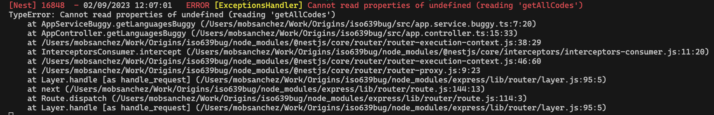

# Description

This repository was created as minimal required code to reproduce the import issue of the library `npm iso-639-1` on NestJS. We are using the library version 3.0.1

## Installation

```bash
$ yarn install
```

## Running the app

```bash
# watch mode
$ yarn run start:dev
```

## Code Structure

The [controller](src/app.controller.ts) class defined two endpoints, http://localhost:3000/buggy and http://localhost:3000/ok, on which we show the minimal code to reproduce the bug and how to work around it.

The controller class import two services

1. [AppServiceBuggy](src/app.service.buggy.ts) on which we import the library `ìso-639-1` to reproduce the bug

```javascript
import { Injectable, Logger } from "@nestjs/common";
import ISO6391, { LanguageCode } from "iso-639-1";

@Injectable()
export class AppServiceBuggy {
  getLanguagesBuggy(): LanguageCode[] {
    return ISO6391.getAllCodes();
  }
}
```

2. [AppService](src/app.service.ok.ts) on which we work around the bug.

```javascript
import { Injectable, Logger } from '@nestjs/common';
import * as ISO6391 from 'iso-639-1';
import { LanguageCode } from 'iso-639-1';

@Injectable()
export class AppService {
  getLanguagesOK(): LanguageCode[] {
    return (ISO6391 as any).getAllCodes();
  }
}
```

## Reproducing the bug

To reproduce the bug you can execute the next command

```bash
#command
curl http://localhost:3000/buggy

#output
{"statusCode":500,"message":"Internal server error"}
```

In the app's console, you should see:


## Work around the bug

To work around the bug you can execute the next command

```bash
#command
curl http://localhost:3000/ok

#output
["aa","ab","ae","af","ak","am","an","ar","as","av","ay","az","ba","be","bg","bi","bm","bn","bo","br","bs","ca","ce","ch","co","cr","cs","cu","cv","cy","da","de","dv","dz","ee","el","en","eo","es","et","eu","fa","ff","fi","fj","fo","fr","fy","ga","gd","gl","gn","gu","gv","ha","he","hi","ho","hr","ht","hu","hy","hz","ia","id","ie","ig","ii","ik","io","is","it","iu","ja","jv","ka","kg","ki","kj","kk","kl","km","kn","ko","kr","ks","ku","kv","kw","ky","la","lb","lg","li","ln","lo","lt","lu","lv","mg","mh","mi","mk","ml","mn","mr","ms","mt","my","na","nb","nd","ne","ng","nl","nn","no","nr","nv","ny","oc","oj","om","or","os","pa","pi","pl","ps","pt","qu","rm","rn","ro","ru","rw","sa","sc","sd","se","sg","si","sk","sl","sm","sn","so","sq","sr","ss","st","su","sv","sw","ta","te","tg","th","ti","tk","tl","tn","to","tr","ts","tt","tw","ty","ug","uk","ur","uz","ve","vi","vo","wa","wo","xh","yi","yo","za","zh","zu"]
```

## License

Nest is [MIT licensed](LICENSE).
